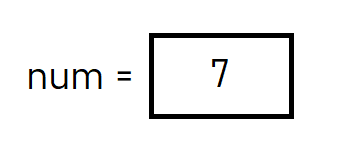
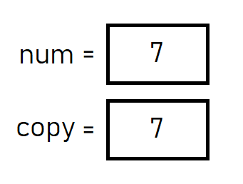
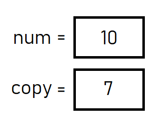
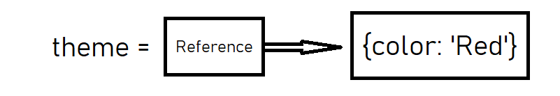
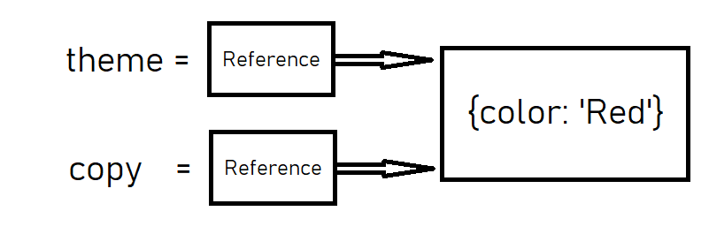
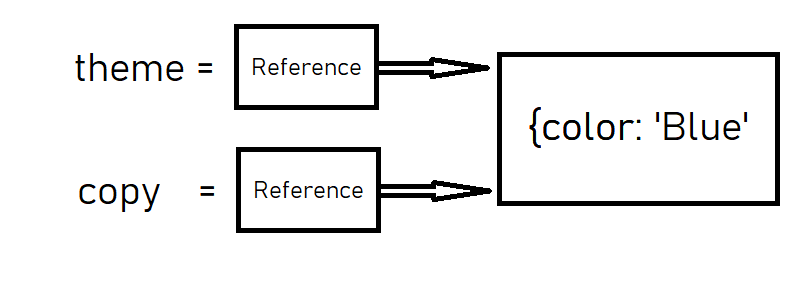

### key points:
#### Primitive Types:
Variables store a literal value, types include:
- Undefined
- Null
- Boolean
- Number
- Bigint
- String
- Symbol

#### Referential Types:
Variables store the address of the object, types include:
- Objects
- Arrays (are objects in JS)

## JS Types
The JS language has 8 data types they are: undefined, null, boolean, number, bigint, string, symbol and object. These data types can be split into two categories, primitive and referential. The distinctions between these two categories are where they are stored in memory and how they are accessed by variables.These differences effect how code behaves when intereacting with primitive or referential types and so it is important to understand them. This article will explain the differences and give examples of how they can cause code to behave differently.

## Primitive Types
In JS primitive types are fixed sizes and so they are stored in the stack portion of memory. When assigned to a variable primitive types are accessed by value, this means the variable holds the literal value that is assigned to it and so any manipulation of the variable will manipulate the actual value. for example if we have a variable num and we assign it the number 7 that variable would hold the value 7.
```
let num = 7;
```


If we was to copy this value to another variable, because it is a primitive type, a new space is created in the stack portion of memory that holds the value 7 so that there are now two seperate portions of memory containing the number 7.
```
let num = 7;
let copy = num;
console.log(copy); // 7
```

As these variables hold two seperate instances of the number 7 we can manipulate one without affecting the other.
```
let num = 7;
let copy = num;
num = num + 3;
console.log(num); // 10
console.log(copy); // 7
```


## Referential Types
Referential types on the other hand are dynamic in size and so they are stored in the heap portion of memory. When assigned to a variable referential types (objects) are accessed by reference, this means the variable holds a reference to the object rather than literally holding the object, a reference is the address in memory where the object is held. for example if we have a variable called theme and assign it an object with a property called color with the value red, the variable would hold a reference to the theme object.
```
let theme = {color: 'Red'};
```

If we was to copy this object to another variable it would behave differently to the example we saw with the primitive type. Rather than creating a new space in memory holding a copy of the original object, copying the variable creates a copy of the reference to the object rather than of the object itself.
```
let theme = {color: 'Red'};
let copy = theme;
```

As these variables contain two references but to the same object if we manipulate either variable we are accessing the same object and so both variables will reflect the change.
```
let theme = {color: 'Red'};
let copy = theme;
theme.color = 'Blue';
console.log(theme.color); // Blue
console.log(copy.color); // Blue
```

